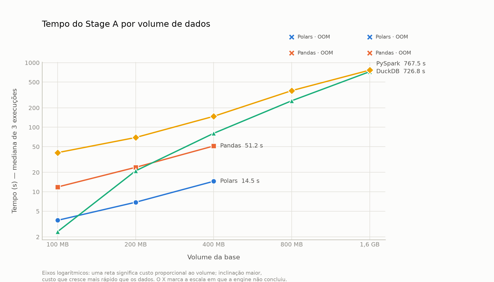

# Análise Comparativa de Engines de Processamento de Dados em Ambiente de Nó Único

Trabalho de Conclusão de Curso — Ciência da Computação.

Compara **Pandas, Polars, DuckDB e PySpark** executando o mesmo pipeline lógico
de preparação de dados para detecção de anomalias, em cinco escalas de volume
(100 MB a 1,6 GB), medindo tempo, memória e CPU.

## Resultados

Mediana de 3 execuções, após aquecimento descartado. Equivalência entre as
engines verificada antes de qualquer comparação.

| Engine | 100 MB | 200 MB | 400 MB | 800 MB | 1,6 GB |
|---|---|---|---|---|---|
| Polars | 3,6 s | **6,9 s** | **14,6 s** | OOM | OOM |
| Pandas | 11,9 s | 23,9 s | 51,2 s | OOM | OOM |
| DuckDB | **2,4 s** | 21,1 s | 80,5 s | **257,2 s** | **726,8 s** |
| PySpark | 40,4 s | 69,3 s | 147,6 s | 369,2 s | 741,2 s |



Três achados:

- **Nenhuma engine vence em todas as escalas.** O DuckDB é o mais rápido em
  100 MB e o penúltimo em 400 MB; o Polars domina no meio; o PySpark, 9x mais
  lento que o Polars em 400 MB, empata com o DuckDB em 1,6 GB (741 s contra
  727 s — dentro da variabilidade). A ordem se inverte duas vezes.
- **As duas engines em memória param em 800 MB**, por motivos opostos: o Pandas
  materializa a tabela, o Polars não transborda o *estado* dos operadores
  (tabelas hash proporcionais à cardinalidade). Mesmo sintoma, causas
  diferentes.
- **Uma única expressão mudou o ponto de ruptura do Polars.** Substituir dois
  `n_unique()` dentro do `group_by` por uma contagem derivada de indicadores já
  agregados reduziu a memória em 29% e o fez concluir os 800 MB — sem alterar
  o resultado. Não removeu a parede, moveu-a uma escala.

Os números brutos estão em [`results/benchmark.csv`](results/benchmark.csv) e
[`results/benchmark_polars_otimizado.csv`](results/benchmark_polars_otimizado.csv)
— uma linha por execução, com tempo por etapa, pico de memória, CPU e status.

## Desenho do experimento

O benchmark se divide em duas etapas, deliberadamente separadas:

| Etapa | O que faz | Implementação |
|---|---|---|
| **Stage A** | Ingestão → limpeza → agregação → join → window → matriz de features | **Uma por engine**, idiomática (Polars em lazy, DuckDB em SQL, Spark em DataFrame API) |
| **Stage B** | Detecção de anomalias + métricas | **Idêntica para todas** — scikit-learn sobre a matriz de features |

A comparação entre engines vive inteiramente no Stage A. Padronizar o Stage B
garante que a diferença medida venha da preparação de dados, e não da
modelagem — além de contornar o fato de o Spark MLlib não oferecer Isolation
Forest nem LOF.

Antes de comparar tempos, um **teste de equivalência** verifica que as quatro
engines produziram a mesma matriz de features (dentro da tolerância de ponto
flutuante). Sem isso, comparar desempenho não significaria nada.

## Base de dados

Estratégia híbrida:

- **Sintética (gerador próprio)** — instrumento de medição. Gerada por processo
  paramétrico com fator de escala, seguindo a metodologia de benchmarks
  padronizados da indústria (TPC-H / TPC-DS). É o único lugar onde há
  comparação entre engines.
- **Credit Card Fraud (Kaggle)** — âncora de validade externa. Roda uma vez,
  numa escala, para demonstrar que o pipeline funciona sobre dados reais.

O modelo é **fato + dimensão**: `transacoes` (grande, com timestamp),
`clientes` (dimensão) e `labels` (rótulos em arquivo separado, para eliminar
por construção qualquer risco de vazamento). Esse desenho é o que faz o
pipeline exercitar `groupBy`, `join` e window function — as operações em que as
engines de fato divergem.

### Escalas

Uma escala é definida como "os primeiros N chunks". Chunks têm seed derivada do
próprio índice, então a base de 100 MB é um subconjunto genuíno da de 1,6 GB
(*nested scaling*), e "mais dados" significa literalmente os mesmos dados mais
outros. O volume dobra a cada escala.

| Escala | Chunks | Transações (aprox.) |
|---|---|---|
| 100mb | 1 | ~6M |
| 200mb | 2 | ~13M |
| 400mb | 4 | ~25M |
| 800mb | 8 | ~50M |
| 1600mb | 16 | ~100M |

## Ambiente

O experimento roda em **WSL2 / Ubuntu**, não no Windows. Dois motivos: o PySpark
depende das bibliotecas nativas do Hadoop para acessar o sistema de arquivos no
Windows (e não há build correspondente ao Hadoop 3.5.0 do PySpark 4.2); e Linux
é o ambiente em que essas engines efetivamente rodam em produção.

O `~/.wslconfig` fixa 10 GB de RAM e 10 núcleos, deixando folga para o Windows, e desliga o swap — o teto de memória fica
explícito e reprodutível, e execuções que estouram falham de imediato com OOM
em vez de entrar em thrashing.

## Setup

```bash
bash scripts/setup_wsl.sh          # JDK 21 + venv Python 3.13 + variáveis
source ~/.bashrc
python scripts/check_spark.py      # go/no-go do PySpark
```

## Uso

```bash
# 1. gerar e validar a base
python -m src.gerador.gerar --calibrar        # afere bytes/linha
python -m src.gerador.gerar --escala 100mb    # gera uma escala
python scripts/validar_base.py 100mb          # valida integridade e dificuldade

# 2. executar o Stage A em cada engine
python scripts/rodar_pipeline.py --engine pandas --escala 100mb
python scripts/rodar_pipeline.py --engine polars --escala 100mb
python scripts/rodar_pipeline.py --engine duckdb --escala 100mb
python scripts/rodar_pipeline.py --engine spark  --escala 100mb

# 3. confirmar que todas produziram a mesma matriz de features
python -m src.analise.equivalencia --escala 100mb

# 4. medir pelo harness (memória, CPU, isolamento, painel ao vivo)
python -m src.benchmark.runner --escalas 100mb --engines polars \
    --repeticoes 1 --sem-aquecimento --saida results/testes.csv

# 5. detecção de anomalias
python -m src.modelos.stage_b --escala 100mb

# 6. figuras e tabela de recomendações
python -m src.analise.graficos
```

> Use sempre `--saida` em testes, para não misturar com `results/benchmark.csv`,
> que guarda os resultados oficiais. A bateria completa (5 escalas × 4 engines ×
> aquecimento + 3 repetições) leva cerca de 3 h nesta máquina.

> `validar_base.py` é um portão de qualidade: reprova a base se as anomalias
> forem detectáveis de forma trivial, se o feature engineering não agregar
> valor, ou se nenhum tipo de anomalia exigir modelo multivariado. Vale rodar
> antes de gastar tempo gerando as escalas grandes.

**Importante:** os dados precisam ficar dentro do sistema de arquivos do WSL
(`TCC_DATA_DIR=~/tcc-data`), nunca em `/mnt/c` — o driver 9p torna o I/O ordens
de grandeza mais lento e contaminaria todas as medições.

## Estrutura

```
src/gerador/      gerador sintético (fato + dimensão + labels)
src/pipelines/    uma implementação do Stage A por engine
src/benchmark/    harness: subprocesso isolado, psutil, timeout
src/modelos/      Stage B — scikit-learn
src/analise/      equivalência entre engines, gráficos
scripts/          setup e validação
results/          CSVs brutos e figuras (versionados)
docs/             documentação do projeto e da metodologia
```

[docs/DADOS.md](docs/DADOS.md) traz o dicionário de dados, como a base é gerada
e quais limitações ela tem. O raciocínio por trás de cada decisão de
implementação está nos próprios módulos — `src/pipelines/base.py` define o
contrato que as quatro engines honram, e é o melhor ponto de partida para ler o
código.

## Reprodutibilidade — leia antes de medir

Três armadilhas que custaram caro aqui e que provavelmente afetam qualquer
benchmark montado em WSL. As duas primeiras produziam números **plausíveis e
errados**, sem nada na saída denunciando o problema.

**1. `/tmp` no WSL é `tmpfs` — memória RAM, não disco.** O padrão de
`spark.local.dir` e do temporário do Polars é o temp do sistema. Tudo o que a
engine "transborda para disco" ia para a RAM, e o transbordo — que deveria
*aliviar* a pressão de memória — era contabilizado como consumo. Corrigir isso
derrubou o pico do Spark em 400 MB de 7.786 para 4.966 MB (−34%) e subiu o
tempo de 95 s para 154 s: o custo real do transbordo, antes escondido.

**2. A linha de base do medidor contamina entre execuções.** A memória é medida
acima de uma base tomada no início de cada execução. Encadeando execuções, o
sistema ainda não devolveu a memória da anterior: a base sai inflada e o pico,
baixo. Chegou a registrar 1,4 GB numa JVM com heap de 6 GB. O harness agora
espera a leitura parar de cair **e** estar perto do menor patamar observado,
antes de medir.

**3. O ambiente precisa estar dedicado.** A medição é da memória do sistema
dentro do WSL. Outro processo relevante rodando junto entra na conta — e
disputa por CPU vinda do Windows nem aparece nas métricas, que são colhidas
dentro do WSL.

Os números deste repositório vêm de um Ryzen 5 5500 (6C/12T, 16 GB) com 10 GB e
10 núcleos dedicados ao WSL e swap desligado. **Valores absolutos não devem
transferir para outra máquina**; o que deve transferir são as relações entre
engines e os pontos de ruptura.
