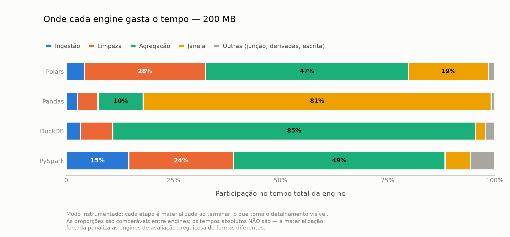

# Análise Comparativa de Engines de Processamento de Dados em Ambiente de Nó Único

Trabalho de Conclusão de Curso — Ciência da Computação.

Compara **Pandas, Polars, DuckDB e PySpark** executando o mesmo pipeline lógico
de preparação de dados para detecção de anomalias, em cinco escalas de volume
(100 MB a 1,6 GB), medindo tempo, memória e CPU.

## Resultados

Mediana de 3 execuções, após aquecimento descartado. Equivalência entre as
engines verificada antes de qualquer comparação.

| Engine | 100 MB | 200 MB | 400 MB | 800 MB | 1,6 GB |
|---|---|---|---|---|---|
| Polars | 2,6 s | **5,1 s** | **11,0 s** | **23,1 s** | OOM |
| Pandas | 10,5 s | 21,1 s | 43,8 s | OOM | OOM |
| DuckDB | **2,2 s** | 16,3 s | 63,7 s | 159,6 s | **512,1 s** |
| PySpark | 32,0 s | 59,2 s | 119,3 s | 322,8 s | 770,1 s |


Quatro achados:

- **Nenhuma engine vence em todas as escalas.** O DuckDB é o mais rápido em
  100 MB e o mais lento depois do PySpark em 400 MB; o Polars domina de 200 MB
  a 800 MB; e em 1,6 GB, onde só duas chegam, o DuckDB volta à frente. A ordem
  se inverte duas vezes.
- **O custo do DuckDB nas escalas grandes é disco, não processador.** Em 1,6 GB
  ele acumula 2.947 núcleo-segundos de espera por I/O contra 652 de trabalho
  efetivo — 4,5 vezes mais tempo esperando do que computando. É o transbordo
  que o mantém de pé e que o torna lento.
- **As duas engines em memória param, por motivos opostos.** O Pandas
  materializa a tabela e para em 800 MB. O Polars chega a 800 MB sem transbordar
  nada (`io_seg` = 0) e para em 1,6 GB: o que não cabe não são os dados, é o
  *estado* dos operadores, proporcional à cardinalidade. Mesmo sintoma, causas
  diferentes.
- **Uma única expressão mudou o ponto de ruptura do Polars.** Substituir dois
  `n_unique()` dentro do `group_by` por uma contagem derivada de indicadores já
  agregados reduziu a memória em ~30%, o tempo em 8-13%, e o fez concluir os
  800 MB — sem alterar o resultado. Não removeu a parede, moveu-a uma escala.
  As duas formas estão medidas: `TCC_POLARS_DISTINTOS` seleciona qual usar.

> **Sobre a reprodutibilidade destes números.** Uma primeira bateria, de
> 23/09, foi descartada: comparada com a atual, era 8% a 38% mais lenta em
> **todas** as engines e escalas, com memória e utilização de CPU idênticas.
> A causa foi atividade no sistema hospedeiro durante a medição, invisível às
> métricas colhidas de dentro do WSL. A coluna `cpu_seg` existe para tornar
> esse tipo de contaminação detectável — ver a seção de reprodutibilidade.

### Onde cada engine gasta o tempo



O custo não está distribuído pelo pipeline, está concentrado em **duas
operações**: a função de janela e a agregação. Junção, atributos derivados e
escrita somam menos de 6% em todas as engines.

A janela é onde o Pandas colapsa — 81% do seu tempo, contra 0,52 s a 3,42 s nas
outras três. E esse número é um **piso**: o Pandas é a única engine que não
recebe a instrumentação (sendo eager, não há o que forçar), então seu valor é o
custo real, enquanto os das demais estão inflados pela materialização forçada.

Os números brutos estão em
[`results/benchmark_v2.csv`](results/benchmark_v2.csv) — uma linha por execução,
com tempo por etapa, pico de memória, CPU, núcleo-segundos e status.

## Desenho do experimento

O benchmark se divide em duas etapas, deliberadamente separadas:

| Etapa | O que faz | Implementação |
|---|---|---|
| **Stage A** | Ingestão → limpeza → agregação → join → window → matriz de features | **Uma por engine**, idiomática (Polars em lazy, DuckDB em SQL, Spark em DataFrame API) |
| **Stage B** | Detecção de anomalias + métricas | **Idêntica para todas** — scikit-learn sobre a matriz de features |

A comparação entre engines vive inteiramente no Stage A. Padronizar o Stage B
garante que a diferença medida venha da preparação de dados, e não da
modelagem — além de contornar o fato de o Spark MLlib não oferecer Isolation
Forest nem LOF.

Antes de comparar tempos, um **teste de equivalência** verifica que as quatro
engines produziram a mesma matriz de features (dentro da tolerância de ponto
flutuante). Sem isso, comparar desempenho não significaria nada.

## Base de dados

**Base sintética, gerada por processo paramétrico com fator de escala**,
seguindo a metodologia de benchmarks padronizados da indústria (TPC-H).

A escolha é imposta pela pergunta: medir como uma engine se comporta conforme o
volume cresce exige que **apenas o volume varie**, com distribuições e
cardinalidade constantes. Nenhuma base real permite isso — tem tamanho fixo, e
replicar registros introduz duplicatas que inflam as métricas de detecção e
distorcem o custo da deduplicação, que é uma das etapas medidas.

Para que a base não seja um conjunto arbitrário de números, ela passa por um
**portão de validação automatizado** (`scripts/validar_base.py`) que a reprova
se as anomalias forem detectáveis trivialmente ou se a construção de atributos
não agregar valor. Durante o desenvolvimento ele reprovou a base três vezes; em
uma delas expôs um defeito real no gerador.

> **Limitação declarada.** O trabalho não demonstra o comportamento das engines
> sobre dados reais. Uma base pública chegou a ser cogitada, mas foi descartada:
> as disponíveis com rótulo de fraude são tabelas únicas de transações, sem
> identificador de cliente ou atributos categóricos, de modo que **não há o que
> agregar, juntar ou janelar** — o Stage A, que é o objeto de medição, não
> poderia ser executado sobre elas. Usar uma base real estruturalmente
> compatível fica como trabalho futuro.

O modelo é **fato + dimensão**: `transacoes` (grande, com timestamp),
`clientes` (dimensão) e `labels` (rótulos em arquivo separado, para eliminar
por construção qualquer risco de vazamento). Esse desenho é o que faz o
pipeline exercitar `groupBy`, `join` e window function — as operações em que as
engines de fato divergem.

### Escalas

Uma escala é definida como "os primeiros N chunks". Chunks têm seed derivada do
próprio índice, então a base de 100 MB é um subconjunto genuíno da de 1,6 GB
(*nested scaling*), e "mais dados" significa literalmente os mesmos dados mais
outros. O volume dobra a cada escala.

| Escala | Chunks | Transações (aprox.) |
|---|---|---|
| 100mb | 1 | ~6M |
| 200mb | 2 | ~13M |
| 400mb | 4 | ~25M |
| 800mb | 8 | ~50M |
| 1600mb | 16 | ~100M |

## Ambiente

O experimento roda em **WSL2 / Ubuntu**, não no Windows. Dois motivos: o PySpark
depende das bibliotecas nativas do Hadoop para acessar o sistema de arquivos no
Windows (e não há build correspondente ao Hadoop 3.5.0 do PySpark 4.2); e Linux
é o ambiente em que essas engines efetivamente rodam em produção.

O `~/.wslconfig` fixa 10 GB de RAM e 10 núcleos, deixando folga para o Windows, e desliga o swap — o teto de memória fica
explícito e reprodutível, e execuções que estouram falham de imediato com OOM
em vez de entrar em thrashing.

## Setup

```bash
bash scripts/setup_wsl.sh          # JDK 21 + venv Python 3.13 + variáveis
source ~/.bashrc
python scripts/check_spark.py      # go/no-go do PySpark
```

## Uso

```bash
# 1. gerar e validar a base
python -m src.gerador.gerar --calibrar        # afere bytes/linha
python -m src.gerador.gerar --escala 100mb    # gera uma escala
python scripts/validar_base.py 100mb          # valida integridade e dificuldade

# 2. executar o Stage A em cada engine
python scripts/rodar_pipeline.py --engine pandas --escala 100mb
python scripts/rodar_pipeline.py --engine polars --escala 100mb
python scripts/rodar_pipeline.py --engine duckdb --escala 100mb
python scripts/rodar_pipeline.py --engine spark  --escala 100mb

# 3. confirmar que todas produziram a mesma matriz de features
python -m src.analise.equivalencia --escala 100mb

# 4. medir pelo harness (memória, CPU, isolamento, painel ao vivo)
python -m src.benchmark.runner --escalas 100mb --engines polars \
    --repeticoes 1 --sem-aquecimento --saida results/testes.csv

# 5. detecção de anomalias
python -m src.modelos.stage_b --escala 100mb --engine duckdb

# 6. modo instrumentado — tempo por etapa (só nas escalas menores)
python -m src.benchmark.runner --escalas 100mb 200mb --repeticoes 3 \
    --staged --saida results/benchmark_staged.csv

# 7. figuras e tabela de recomendações
python -m src.analise.graficos --entrada results/benchmark_v2.csv \
    --variante "n_unique=results/benchmark_polars_nunique.csv" \
    --etapas results/benchmark_staged.csv
```

> **Use sempre `--saida` em testes**, para não misturar com os resultados
> oficiais. A bateria completa (5 escalas × 4 engines × aquecimento + 3
> repetições) leva cerca de 3 h nesta máquina.

### Onde ficam os resultados

| Arquivo | Conteúdo |
|---|---|
| `results/benchmark_v2.csv` | **a bateria oficial** — é dela que saem os números deste README |
| `results/benchmark_staged.csv` | modo instrumentado: composição do tempo por etapa |
| `results/benchmark_polars_nunique.csv` | Polars com `n_unique()` dentro do `group_by`, para a comparação das duas formas |
| `results/stage_b.csv` | detecção de anomalias nas cinco escalas, por modelo e por tipo |
| `results/benchmark.csv` | bateria de 23/09, **descartada** — mantida como registro, não usar |

> `validar_base.py` é um portão de qualidade: reprova a base se as anomalias
> forem detectáveis de forma trivial, se o feature engineering não agregar
> valor, ou se nenhum tipo de anomalia exigir modelo multivariado. Vale rodar
> antes de gastar tempo gerando as escalas grandes.

**Importante:** os dados precisam ficar dentro do sistema de arquivos do WSL
(`TCC_DATA_DIR=~/tcc-data`), nunca em `/mnt/c` — o driver 9p torna o I/O ordens
de grandeza mais lento e contaminaria todas as medições.

## Estrutura

```
src/gerador/      gerador sintético (fato + dimensão + labels)
src/pipelines/    uma implementação do Stage A por engine
src/benchmark/    harness: subprocesso isolado, psutil, timeout
src/modelos/      Stage B — scikit-learn
src/analise/      equivalência entre engines, gráficos
scripts/          setup e validação
results/          CSVs brutos e figuras (versionados)
docs/             dicionário de dados e diagrama do modelo
```

As figuras em `results/figuras/` saem todas de `src/analise/graficos.py`:
tempo e memória por escala, e a composição do tempo por etapa — esta última
responde à pergunta de em quais operações as engines divergem.

[docs/DADOS.md](docs/DADOS.md) traz o dicionário de dados, como a base é gerada
e quais limitações ela tem. O raciocínio por trás de cada decisão de
implementação está nos próprios módulos — `src/pipelines/base.py` define o
contrato que as quatro engines honram, e é o melhor ponto de partida para ler o
código.

## Reprodutibilidade — leia antes de medir

Três armadilhas que custaram caro aqui e que provavelmente afetam qualquer
benchmark montado em WSL. As duas primeiras produziam números **plausíveis e
errados**, sem nada na saída denunciando o problema.

**1. `/tmp` no WSL é `tmpfs` — memória RAM, não disco.** O padrão de
`spark.local.dir` e do temporário do Polars é o temp do sistema. Tudo o que a
engine "transborda para disco" ia para a RAM, e o transbordo — que deveria
*aliviar* a pressão de memória — era contabilizado como consumo. Corrigir isso
derrubou o pico do Spark em 400 MB de 7.786 para 4.966 MB (−34%) e subiu o
tempo de 95 s para 154 s: o custo real do transbordo, antes escondido.

**2. A linha de base do medidor contamina entre execuções.** A memória é medida
acima de uma base tomada no início de cada execução. Encadeando execuções, o
sistema ainda não devolveu a memória da anterior: a base sai inflada e o pico,
baixo. Chegou a registrar 1,4 GB numa JVM com heap de 6 GB. O harness agora
espera a leitura parar de cair **e** estar perto do menor patamar observado,
antes de medir.

**3. O ambiente precisa estar dedicado — e isso é mais sério do que parece.**
A medição é da memória do sistema dentro do WSL, então outro processo rodando
junto entra na conta. Pior: **disputa por CPU vinda do sistema hospedeiro não
aparece em métrica nenhuma** colhida de dentro do WSL, e o Hyper-V não preenche
o campo `steal` de `/proc/stat` que a denunciaria.

Isso não é hipotético. A bateria de 23/09 deste projeto saiu 8% a 38% mais
lenta que a atual em todas as engines e escalas, com **memória e utilização
percentual de CPU idênticas** — e nada no resultado indicava problema. Só a
comparação de **núcleo-segundos** revelou: a execução contaminada consumiu ~48%
mais CPU para produzir o mesmo resultado.

Por isso o CSV registra `cpu_seg` e `io_seg`. Duas execuções do mesmo trabalho
com consumo de núcleo-segundos diferente são incomparáveis, e agora isso se lê
direto no arquivo. **Ao reproduzir, compare o `cpu_seg` entre repetições antes
de confiar nos tempos.**

Os números deste repositório vêm de um Ryzen 5 5500 (6C/12T, 16 GB) com 10 GB e
10 núcleos dedicados ao WSL e swap desligado. **Valores absolutos não devem
transferir para outra máquina**; o que deve transferir são as relações entre
engines e os pontos de ruptura.
