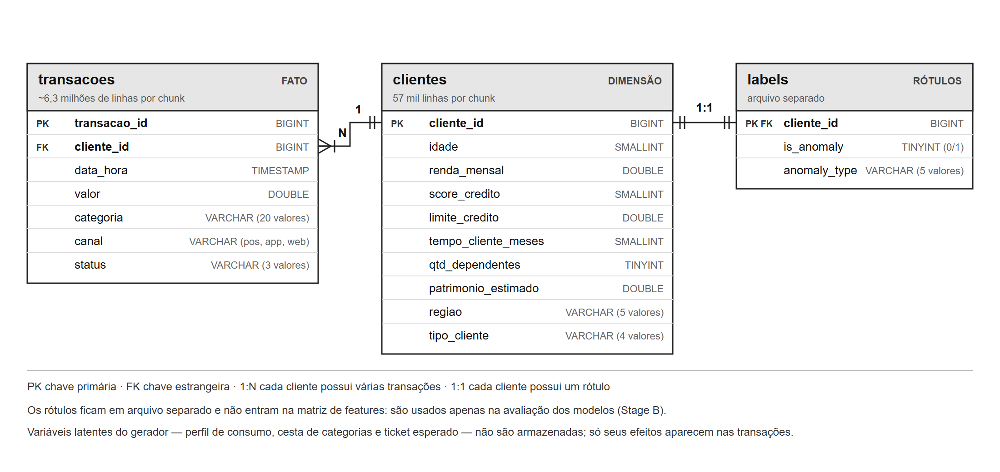

# Base de Dados Sintética — Descrição, Pertinência e Papel da Base Real

Material de apoio para o capítulo de Metodologia. Os números abaixo foram
medidos sobre um chunk (escala de 100 MB) em 14/09/2026.

---

## 1. O que a base representa

Clientes de uma instituição financeira e as transações de cartão que realizam ao
longo de 12 meses (01/01/2025 a 31/12/2025). O modelo é dimensional: uma tabela
fato de transações, uma dimensão de clientes e um arquivo separado de rótulos.

*Versão vetorial, para inserir na monografia: `diagramas/modelo_dados.svg`.*

---

## 2. Dicionário de dados

### `transacoes` — fato

| Coluna | Tipo | Descrição | Domínio |
|---|---|---|---|
| `transacao_id` | BIGINT | Identificador da transação (PK) | único |
| `cliente_id` | BIGINT | Cliente que realizou a transação (FK) | — |
| `data_hora` | TIMESTAMP | Momento da transação | 2025-01-01 a 2025-12-31 |
| `valor` | DOUBLE | Valor em reais | mín. 1,01 · mediana 118,65 · p99 469,00 · máx. 6.507,30 |
| `categoria` | VARCHAR | Tipo de estabelecimento | 20 valores (supermercado, farmácia, viagem, …) |
| `canal` | VARCHAR | Meio da compra | pos 53% · app 34% · web 13% |
| `status` | VARCHAR | Resultado da autorização | aprovada 94% · negada 5% · estornada 1% |

### `clientes` — dimensão

| Coluna | Tipo | Descrição | Domínio |
|---|---|---|---|
| `cliente_id` | BIGINT | Identificador do cliente (PK) | único |
| `idade` | SMALLINT | Idade em anos | 18 a 80 |
| `renda_mensal` | DOUBLE | Renda mensal em reais | mín. 1.200 · mediana 6.302 · máx. 15.205 |
| `score_credito` | SMALLINT | Pontuação de crédito | 300 a 1.000 |
| `limite_credito` | DOUBLE | Limite do cartão | — |
| `tempo_cliente_meses` | SMALLINT | Tempo de relacionamento | 1 a 120 |
| `qtd_dependentes` | TINYINT | Número de dependentes | 0 a 8 |
| `patrimonio_estimado` | DOUBLE | Patrimônio estimado | — |
| `regiao` | VARCHAR | Região do país | 5 valores (Sudeste 45%, Nordeste 20%, …) |
| `tipo_cliente` | VARCHAR | Segmento | Bronze 45% · Prata 30% · Ouro 18% · Platina 7% |

### `labels` — rótulos

| Coluna | Tipo | Descrição |
|---|---|---|
| `cliente_id` | BIGINT | Cliente (PK e FK) |
| `is_anomaly` | TINYINT | 1 = anômalo, 0 = normal (2% de anômalos) |
| `anomaly_type` | VARCHAR | `normal`, `rajada`, `ticket_desproporcional`, `migracao_canal`, `multivariada` |

### Volume por chunk

57.000 clientes e ~6,3 milhões de transações. Cada cliente tem entre 7 e 714
transações no ano (mediana 97).

---

## 3. Como os dados são gerados

Os valores não são sorteados de forma independente. O gerador reproduz relações
que se esperariam em dados reais:

- **Atributos correlacionados na dimensão:** idade → renda → score → limite.
- **Valores com cauda longa:** o valor de cada transação segue uma distribuição
  lognormal em torno de um ticket esperado, proporcional à renda do cliente.
  Poucas compras são muito caras, como em gastos reais.
- **Frequência heterogênea:** clientes de segmentos superiores transacionam
  mais.
- **Subpopulações legítimas**, com características extremas sem serem
  anômalas: varejista (muitas compras pequenas), digital (nunca usa canal
  presencial), sazonal (compras concentradas em épocas do ano) e premium de baixa
  frequência (poucas compras de valor alto).
- **Cestas de consumo:** cada cliente concentra 80% do gasto em 5 categorias de
  um de 8 arquétipos (família, estudante, motorista, …), o que cria correlação
  entre categorias.

Três variáveis são **latentes**: perfil, cesta e ticket esperado. O gerador as
usa, mas elas não são gravadas em nenhuma tabela. As engines só observam seus
efeitos nas transações, como aconteceria com dados reais.

Sobre essa população são injetados os quatro tipos de anomalia (2% dos
clientes), desenhados para só se tornarem visíveis após o feature engineering:

| Tipo | Mecanismo | Operação que o revela |
|---|---|---|
| `rajada` | metade das transações do cliente concentrada em 2 dias | função de janela temporal |
| `ticket_desproporcional` | valores 1,8–3× acima do esperado para a renda | razão com a dimensão |
| `migracao_canal` | passa de presencial a web na segunda metade do ano | cruzamento de tempo e canal |
| `multivariada` | mistura duas cestas que não coocorrem; score e limite incompatíveis | modelo multivariado |

---

## 4. Os dados são pertinentes?

Para responder, é preciso separar **o que a base precisa representar bem** do
que ela não se propõe a representar.

### O que ela precisa representar bem — e representa

O objeto de medição do trabalho é a **carga de processamento** da preparação de
dados, e não o comportamento financeiro em si. Para isso, a base precisa ter:

| Requisito | Situação |
|---|---|
| Volume controlável, mantendo as distribuições | ✓ fator de escala com *nested scaling* |
| Estrutura que exija agregação, junção e janela | ✓ modelo fato + dimensão |
| Colunas de texto de baixa e média cardinalidade | ✓ categoria, canal, status, região, segmento |
| Distribuição realista de valores | ✓ lognormal com cauda longa |
| Anomalias que não sejam triviais | ✓ **verificado**: sobre os atributos brutos o PR-AUC fica em ~0,09; após o feature engineering, ~0,46 |
| Modelos diferentes vencendo tipos diferentes | ✓ **verificado** pelo portão de validação |

Os dois últimos itens não são afirmação: foram medidos pelo
`scripts/validar_base.py`, que reprovaria a base se as anomalias fossem
detectáveis de forma trivial.

### Limitações que devem ser declaradas

- **Distribuições definidas pelo autor**, e não ajustadas a dados reais. São
  plausíveis, mas não calibradas.
- **Timestamps uniformes ao longo do ano.** Não há padrão por hora do dia ou dia
  da semana, exceto no perfil sazonal.
- **Não há entidade de estabelecimento** (*merchant*), só a categoria.
- **Assimetria moderada entre clientes.** O cliente mais ativo tem ~7× a mediana
  de transações. Dados reais costumam ser mais concentrados, e essa concentração
  (*skew*) afeta sobretudo o Spark, cujo desempenho em junções e shuffle é
  sensível a partições desbalanceadas.
- **Base perfeitamente limpa:** zero nulos e zero duplicatas. Consequência
  prática: a etapa de limpeza do pipeline mede o **custo de verificar**, mas não
  remove nada.
- **Rótulo por cliente**, e não por transação.

### Por que, mesmo assim, uma base sintética

Nenhuma base pública permite dobrar o volume mantendo as distribuições
constantes, e é exatamente isso que o experimento exige: o objeto de medição é
como as engines se comportam conforme o volume cresce, o que só faz sentido se
tudo o mais permanecer igual.

Replicar registros de uma base real não resolve — duplicatas inflam
artificialmente as métricas e distorcem o custo da deduplicação, que é uma das
etapas medidas.

É a mesma razão pela qual os benchmarks TPC-H e TPC-DS usam geradores
paramétricos em vez de dados reais.
